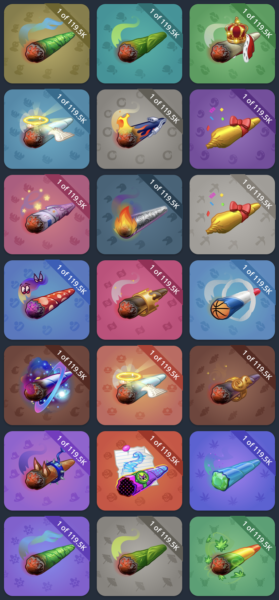
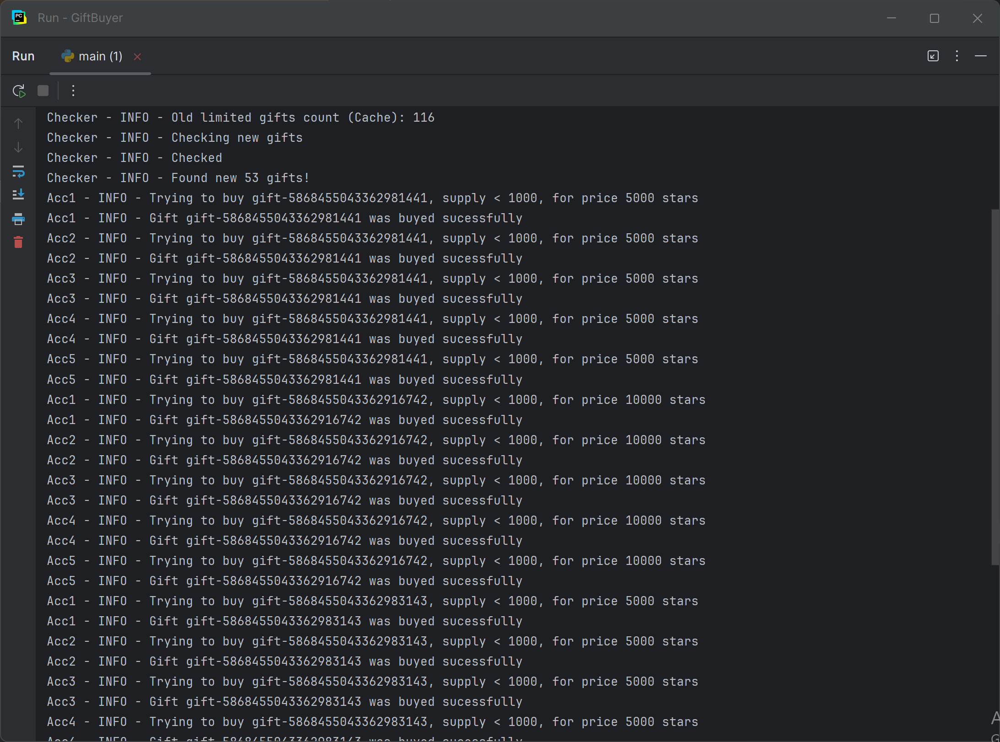
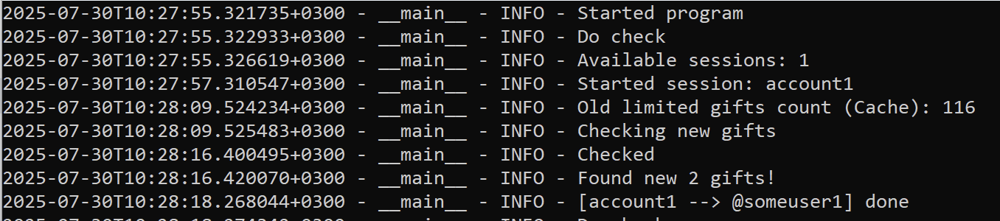

# Telegram Fash Gift Buyer 🎁⚡


Скрипт автоматизирует покупку лимитированных подарков в Telegram, используя несколько аккаунтов. Покупка начинается с самых редких подарков и продолжается до исчерпания баланса или доступности. Редкие подарки раскупаются ботами за секунды, с этим ботом ты тоже сможешь войти в число счастливчиков.
<p align="center">
  
  
</p>

## ✨ Особенности

- **Мультиаккаунтинг** - Поддержка мультиаккаунтной стратегии для управления Telegram Stars
- **Индивидуальная настройка** — Для каждого аккаунта можно указать собственного получателя подарков
- **Умные фильтры** - Гибкая система правил по ограничению покупок в зависимости от количества и цены подарков
- **Регулируемая скорость** — Настраиваемые паузы между отправкой подарков и периодами опроса  
- **Режим симуляции** — Возможность протестировать логику без списания средств  
- **Автопоиск подарков** — Скрипт отслеживает появление новых лимитированных подарков в реальном времени

## 🚀 Быстрый старт
**0. Склонируйте репозиторий**
```bash
git clone https://github.com/k0d4dusha/GiftBuyerFlash.git
cd GiftFlashBuyer
```
Либо загрузите вручную и распакуйте архив

![[IMG-20250803232557515.png]]

Распакованный архив должен выглядеть следующим образом

![[IMG-20250803232915647.png]]

**1. Установите Python, если он не установлен

[Установка Python на Windows](https://python-scripts.com/install-python-windows)

**2. Установите зависимости:**

Откройте командную строку

![[IMG-20250803232656376.png]]

Перейдите в директорию с распакованным архивом и введите команду для установки зависимостей

```bash
cd GiftFlashBuyer
pip install -r requirements.txt
```

![[IMG-20250803232712994.png]]

**2. Создайте сессии для ваших аккаунтов:**
- В файле `session_create.py` впишите имя сессии для аккаунта (например, `name_session = "account1"`)

![[IMG-20250803233550006.png]]

- Запустите `python.exe ./session_create.py`

![[IMG-20250803233823620.png]]

- Авторизуйтесь по номеру телефона

![[IMG-20250803234357068.png]]

- Повторите для всех используемых аккаунтов (с разными именами сессий в файле session_create.py)

Таким образом создадутся файлы сессий `.session` локально, которые далее будут использоваться скриптом покупки

![[IMG-20250803234517960.png]]

**3. Настройте скрипт:**
- Откройте `config.toml`

![[IMG-20250803234642115.png]]

- Укажите имена сессий для проверки новых подарков, например
```toml
...
# Аккаунты для проверки выхода новых подарков
sessions_for_checking = ["account1", "account2", ...]
...
```

- Снова укажите имя сессии (аккаунта который будет покупать) в session_name_send_from, а также username пользователя, которому будет отправлен подарок в username_send_to. Таких блоков настроек может быть несколько
```toml
...
# Конфигурация отправки подарков
[[send_config]]
session_name_send_from = "account1" # Аккаунт со звёздами (Имя сессии)
username_send_to = "@someuser1"     # Получатель подарков

#[[send_config]]
#session_name_send_from = "account2"
#username_send_to = "@someuser2"
...
```

То есть: от какого аккаунта (название сессии) → какому (юзернейм) мы отправляем подарок. Копируйте строчки аналогично для каждой сессии.

- Задержки между запросами, которые выбираются на свой страх и риск. Рекомендуется оставить по-умолчанию
```toml
...
# Задержки
sleep_send_seconds = 0.2        # Задержка между запросами на отправку подарков
sleep_checking_seconds = 1      # Задержка между циклами проверки новых подарков
...
```

 - Тестовый режим для проверки работы скрипта. Для реальных покупок установить is_test_mode = false i
 - s_infinite_buying - оставляем по умолчанию

```toml
# Режимы
is_test_mode = true             # Режим, чтобы протестировать работу, программа будет думать, как будто имеется 2 доступных подарка для покупки
is_infinite_buying = true       # В данном режмие после покупки программа продолжит проверять новые подарки и закупать
```

- Фильтры подарков

Вы можете настроить несколько взаимно не связанных условий для покупки подарков:
- Диапазоны саплая (общее количество выпущенных подарков того типа который мы хотим купить)
- Диапазоны цен (Диапазон цены подарка, который нас устраивает). inf - значит до бесконечности

```toml
[[gift_filters]]
supply_range = ["0", "1000"]        # Диапозон сапплая: [От, До]
price_range = ["30001", "inf"]      # Диапозон цены:    [От, До]

[[gift_filters]]
supply_range = ["1001", "3000"]
price_range = ["30001", "inf"]
```

**4. Запустите скупщик:**
```bash
python.exe ./main.py
```

![[IMG-20250803235309580.png]]




Ошибка `StargiftUsageLimited` говорит о том, что сервер телеграма получил наш запрос и ответил нам, что подарок уже раскупили. Значит все параметры настроены, библиотеки установлены, интернет присутствует.

## 📝 Примечания

1. Убедитесь, что на ваших аккаунтах есть достаточное количество Telegram Stars.
2. Для работы скрипта необходимо стабильное интернет-соединение
3. Рекомендуется запускать скрипт на **Windows** для возможности активного контроля действий
4. Telegram может ввести лимиты на запросы - настройте разумные задержки
5. Внимательно настраивайте условия покупки - слишком строгие фильтры могут пропустить желанные подарки
6. Мониторьте логи работы скрипта и при необходимости корректируйте условия
7. Цены и суплай подарков могут меняться - регулярно обновляйте свои фильтры

## 📜 Лицензия

MIT License. Используйте на свой страх и риск. Автор не несет ответственности за возможные последствия.

---
Сделано с ❤️ для чистого Telegram-опыта
